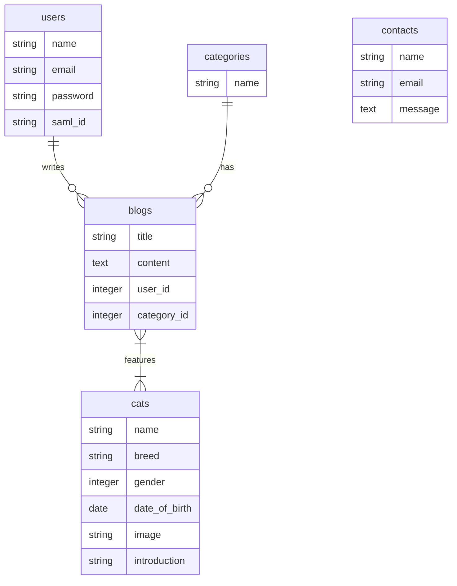

# La NekoCafe

## 概要

保護猫カフェ「La NekoCafe」の Web アプリケーションです。
猫の紹介、ブログ発信、お問い合わせ機能などを提供し、管理画面からはこれらを一元管理することができます。
SAML 認証を利用した SSO（シングルサインオン）や、Laravel Reverb を用いたリアルタイム通知機能も実装されています。

## 機能

### 一般ユーザー向け

-   **トップページ**: カフェの紹介、アクセスマップなど。
-   **ブログ**: お店の様子や猫たちの日常を発信。カテゴリやタグ（猫）による絞り込み閲覧が可能。
-   **お問い合わせ**: お店への問い合わせフォーム。送信完了後に自動返信メールを送信。

### 管理者向け

-   **ダッシュボード**: サイトの概況確認。
-   **ブログ管理**: 記事の作成、編集、削除。
-   **お問い合わせ管理**: 受信したお問い合わせの確認。リアルタイム通知機能により、新規問い合わせを即座に把握可能。
-   **ユーザー管理**: 管理者アカウントの作成。
-   **認証機能**: 通常のメールアドレス/パスワード認証に加え、SAML 認証（Keycloak 連携）をサポート。

## 技術スタック

| Category      | Technology                                                                                                                                                                                                                  |
| ------------- | --------------------------------------------------------------------------------------------------------------------------------------------------------------------------------------------------------------------------- |
| **Language**  |                                                                                                                                          |
| **Framework** |                                                                                                                        |
| **Frontend**  |   |
| **Database**  |                                                                                                                       |
| **Real-time** | Laravel Reverb, Laravel Echo, Pusher JS                                                                                                                                                                                     |
| **Auth**      | Laravel SAML2 (aacotroneo/laravel-saml2)                                                                                                                                                                                    |

## 環境構築手順

### 前提条件

-   PHP 8.2 以上
-   Composer
-   Node.js & NPM

### セットアップ

1. **リポジトリのクローン**

    ```bash
    git clone <repository-url>
    cd <repository-directory-name>
    ```

2. **依存関係のインストール**

    ```bash
    composer install
    npm install
    ```

3. **環境変数の設定**
   `.env.example` をコピーして `.env` を作成します。

    ```bash
    cp .env.example .env
    php artisan key:generate
    ```

    ※デフォルトでは SQLite を使用するため、DB 接続設定の変更は基本的に不要です。

4. **データベースの準備**
   SQLite ファイルを作成し、マイグレーションとシーダーを実行します。

    ```bash
    touch database/database.sqlite
    php artisan migrate --seed
    ```

5. **アセットのビルド**

    ```bash
    npm run build
    ```

6. **アプリケーションの起動**
   開発サーバーと Reverb サーバー（リアルタイム通信用）を起動します。

    ```bash
    # 開発サーバーの起動
    php artisan serve

    # 別ターミナルでReverbサーバーの起動
    php artisan reverb:start
    ```

    ブラウザで `http://localhost:8000` にアクセスしてください。

## プロジェクト構成

### ER 図



### ディレクトリ構成

```
cat-cafe/
├── app/                 # アプリケーションのコアロジック (Models, Controllers, etc.)
├── bootstrap/           # フレームワークの起動スクリプト
├── config/              # 設定ファイル (SAML, Reverb設定など)
├── database/            # マイグレーション, シーダー, SQLiteファイル
├── public/              # 公開ディレクトリ (画像, CSS, JS)
├── resources/           # ビュー(Blade), 生のCSS/JS
├── routes/              # ルーティング定義 (web.php, api.php)
├── storage/             # ログ, キャッシュ, ファイルアップロード先
├── tests/               # テストコード
└── vendor/              # Composer依存パッケージ
```

## ライセンス

このプロジェクトは [MIT ライセンス](https://opensource.org/licenses/MIT) の元で公開されています。
